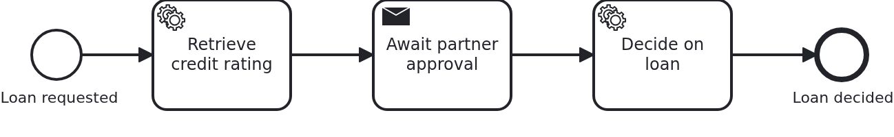

# Showing BPMN and execution history

[](./LICENSE)

Sooner or later somebody asks to see the process: the diagram, and on top of it what this
one case has done so far. This blueprint serves both from the application, through three
methods which read and change nothing.

## What this blueprint shows



The loan approval of the base blueprint with one wait state added, so there is something to
look at while the workflow is still running. Three endpoints answer what a viewer needs:

```
GET /api/loan-approval/{id}/definitions   which process definitions this workflow uses
GET /api/loan-approval/{id}/diagram       the BPMN XML of one of them
GET /api/loan-approval/{id}/history       what this workflow has done, element by element
```

They map one to one onto `ProcessService#getProcessDefinitions`, `#getBpmnXml` and
`#getWorkflowHistory`, and all three live in `Workflow.java` next to `startWorkflow` - the
one class allowed to touch `ProcessService`. They are the only part of the SPI which does not
change a thing: no transaction, no progress, nothing persisted.

**The element ids are the point.** A `WorkflowHistory` holds when the workflow started, when
it ended if it did, and its elements in execution order with their start and end times. An
element which has started and not ended is where the workflow stands, which is what a viewer
like [bpmn.io](https://bpmn.io/) colours. Feed it the XML from `/diagram` and the ids from
`/history` and the picture draws itself; this blueprint stops at the API, because a UI is not
what a blueprint should teach.

**A process definition id is opaque.** It looks like something you could take apart, and you
must not: VanillaBP prefixes the BPMS' own id with the adapter that can resolve it, because a
workflow may run in any configured BPMS and `getBpmnXml` has no aggregate to derive one from.
Pass it back exactly as it came.

**Not every BPMS records the same.** Some report every flow node, some only activities, and a
remote engine reports with a delay because its history is fed by an exporter. The test of this
blueprint is written accordingly: it waits for the history rather than asserting it right
away, and it checks that the elements it drove through are in there, not that they are the
only ones. Camunda 8 needs secondary storage for any of this, which its adapter documents.

**Ended workflows can be shown too**, as long as the BPMS still holds them. Once its history
retention cleaned up, `getWorkflowHistory` says so with a guiding
`WorkflowNotFoundException` rather than an empty answer.

## Delta to the base blueprint

Compared to [`module-single`](https://github.com/vanillabp-blueprints/module-single-quarkus):

|            File            |                                       What is different                                        |
|----------------------------|------------------------------------------------------------------------------------------------|
| `loan_approval.bpmn`       | a task the workflow waits at, so a running workflow has something to show, and a task after it |
| `Workflow.java`            | the three viewer methods next to `startWorkflow` and `completeTask`                            |
| `Service.java`             | passes them through, and says in its log where to look                                         |
| `ApiController.java`       | `/definitions`, `/diagram` and `/history`                                                      |
| `Aggregate.java`           | the id of the task the workflow waits at, so the wait can be answered                          |
| `WorkflowTaskHandler.java` | the `@TaskId` handler of that task                                                             |
| `LoanApprovalIT.java`      | asks what a viewer asks, while the workflow runs and after it ended                            |

The wait state is not the subject here. It exists because a history of a workflow which
finished in twenty milliseconds shows nothing worth looking at. How an asynchronous task
works is
[`bpmn-async-task`](https://github.com/vanillabp-blueprints/bpmn-async-task-quarkus).

## Running it

Requires a JDK 21. Camunda 7 is embedded, so nothing else has to run:

```bash
mvn install verify
```

Running it on another BPMS is a Maven profile, not one line of Java changes:

```bash
mvn install verify -Pcamunda8
```

Camunda 8 is a remote engine, so a cluster has to run. It also needs **secondary storage** for
this blueprint: definitions and history are served by the query API, and a cluster without it
reports no element history at all. Start one; its address, and everything else specific to that
engine, lives in its profile file `application/src/main/resources/application-camunda8.yaml`,
with a copy for the module's own test:

```yaml
vanillabp:
  adapters:
    camunda8:
      # Camunda 8 is a remote engine: point this at your cluster.
      rest-address: http://localhost:8080
```

That file is loaded because the Maven profile `camunda8` makes the config profile of the same
name the parent of whichever profile the application runs in, so the engine is chosen once, on
the Maven command line, and the build, the tests and `quarkus:dev` all follow it.

Start the application:

```bash
mvn -pl application quarkus:dev
```

Booting logs a warning per workflow module: both Camunda adapters start out with
`name-clash-avoidance: none`, so nothing keeps the identifiers of one workflow module apart
from those of another, and the adapter asks for a decision instead of picking one. One module
cannot collide with itself, so this blueprint leaves it at that. Answering the question is one
property, `vanillabp.adapters.<id>.accept-unscoped-identifiers: true`, and the modes a BPMS
offers are in
[the wiki](https://github.com/vanillabp/adapter-platform-integration/wiki/Workflow-modules#how-name-clashes-are-avoided).

This is the URL that starts a loan approval:

```
http://localhost:8080/api/loan-approval/start?amount=5000
```

The workflow then waits, and the log says where to look:

```
Loan approval '4d0e…' waits for the partner. Look at it while it waits:
  http://localhost:8080/api/loan-approval/4d0e…/history
Approve -> http://localhost:8080/api/loan-approval/4d0e…/approve
```

The history of the waiting workflow names the element it stands at, without an end time:

```json
{
  "processDefinitionId": "camunda7:loan_approval:1:8f2c…",
  "startTime": "2026-08-15T15:11:42.531+02:00",
  "endTime": null,
  "elementsHistory": [
    { "elementId": "ServiceTask_RetrieveCreditRating", "startTime": "…", "endTime": "…" },
    { "elementId": "SendTask_AwaitPartnerApproval", "startTime": "…", "endTime": null }
  ]
}
```

The diagram behind it is the BPMN the BPMS holds, which is the model VanillaBP deployed:

```
http://localhost:8080/api/loan-approval/{loanRequestId}/diagram
```

Answer the wait with the `approve` URL and ask again: the last element has an end time, the
task after it appears, and the workflow itself has one.

## How it works

|                                            File                                            |                                  Role                                  |
|--------------------------------------------------------------------------------------------|------------------------------------------------------------------------|
| `.../loanapproval/Workflow.java`                                                           | the three viewer methods, where `ProcessService` is injected           |
| `.../loanapproval/ApiController.java`                                                      | the GET endpoints a UI would call                                      |
| `.../loanapproval/Service.java`                                                            | passes the calls through, without a transaction - nothing is changed   |
| `loan-approval/src/main/resources/loan-approval/processes/<adapter-id>/loan_approval.bpmn` | the process, with one wait state so a running workflow shows something |
| `loan-approval/src/test/.../LoanApprovalIT.java`                                           | asks the BPMS what a viewer asks, while running and after the end      |

The order of events: `getProcessDefinitions` locates the workflow in whichever BPMS holds it
and reports the definition it runs on, `getBpmnXml` resolves an id to its model, and
`getWorkflowHistory` reads the elements. Which BPMS answers is VanillaBP's business, and the
opaque definition id is what carries that decision from one call to the next.

A process with call activities returns more than one definition, each naming the elements
that call it, and the history of an executed call activity carries a
`secondaryWorkflowHistoryContext` to dig one level down. This blueprint has no call activity,
so both endpoints take the context as an optional parameter and pass it on -
[`bpmn-call-activity-decomposition`](https://github.com/vanillabp-blueprints/bpmn-call-activity-decomposition-quarkus)
is the model to try that with.

## Documentation

- [Viewing workflows](https://github.com/vanillabp/adapter-platform-integration/wiki/Viewing-workflows): the three methods, opaque ids, ended workflows and what differs per BPMS
- [Viewing BPMN and execution history](https://github.com/vanillabp/spi-for-java#viewing-bpmn-and-execution-history-of-workflows): the record types and how a viewer is fed
- [Workflow aggregates](https://github.com/vanillabp/adapter-platform-integration/wiki/Workflow-aggregates): why the aggregate is all VanillaBP needs to find the workflow again
- the wiki of the [BPMS adapter](https://github.com/vanillabp/adapter-platform-integration/wiki/BPMS-adapters) you use: what that engine records, and what it needs to record it

This blueprint is developed in the monorepo
[`blueprints`](https://github.com/vanillabp-blueprints/blueprints). This repository is a
read-only mirror, **issues and pull requests belong there.**

## Noteworthy & Contributors

[VanillaBP](https://www.github.com/vanillabp/spi-for-java) was developed by [Phactum](https://www.phactum.at) with the
intention of giving back to the community as it has benefited the community in the past.


## License

Copyright 2026 Phactum Softwareentwicklung GmbH

Licensed under the Apache License, Version 2.0
